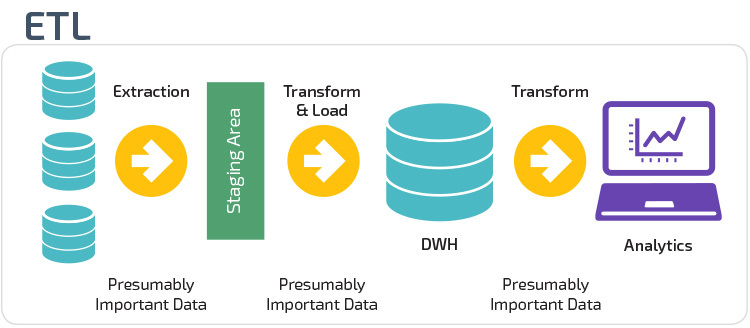

# Extract Transform Load (ETL)
 The main aim of this repository is to Build an ETL Pipeline(Extract Transform Load Pipeline). To automate the process of ETL and learn more about stage in ETL.

### Table of contents

    <ol>
        <li><a href="#ref1">Introduction </a></li>
        <li><a href="#ref2">Exercises on Extract Transform Load</a></li>
        <ul>
         <li><a href="#ref3">Extract exercises</a></li>
        <li><a href="#ref4">Transform exercises</a></li>
        <li><a href="#ref4">Load exercises</a></li>
        </ul>
        <li><a href="#ref5">ETL Pipeline</a></li>
        <li><a href="#ref7">Results</a></li>
        <li><a href="#ref9">Conclusion section</a></li>
        <li><a href="#ref9">References</a></li>
    </ol>

 

## 1. Introduction
ETL is short for extract, transform, load, three database functions that are combined into one tool to pull data out of one database and place it into another database.

1. **Extract** is the process of reading data from a database. In this stage, the data is collected, often from multiple and different types of sources.

2. **Transform** is the process of converting the extracted data from its previous form into the form it needs to be in so that it can be placed into another database. Transformation occurs by using rules or lookup tables or by combining the data with other data.

3. **Load** is the process of writing the data into the target database

<a href="https://panoply.io/data-warehouse-guide/3-ways-to-build-an-etl-process/">Source</a>

## 2. Exercises on Extract Transform Load

1. Extract data from different sources such as
    1. csv
    2. Json files
    3.  API's
2. Transform Data
    1. combining data from different sources
    2. data cleaning
    3. data types
    4.  parsing dates
    5. file encodings
    6. missing data
    7. duplicate data
    8. dummy variables
    9. remove outliers
    10. scaling features
    11. engineering features
3. Load
    1. Send the transformed data to a database

## 3. ETL Pipeline
- code an ETL pipeline

## 4. Results
*under development*
## 5. Conclusion
*under development*

## 6. References
*under development*